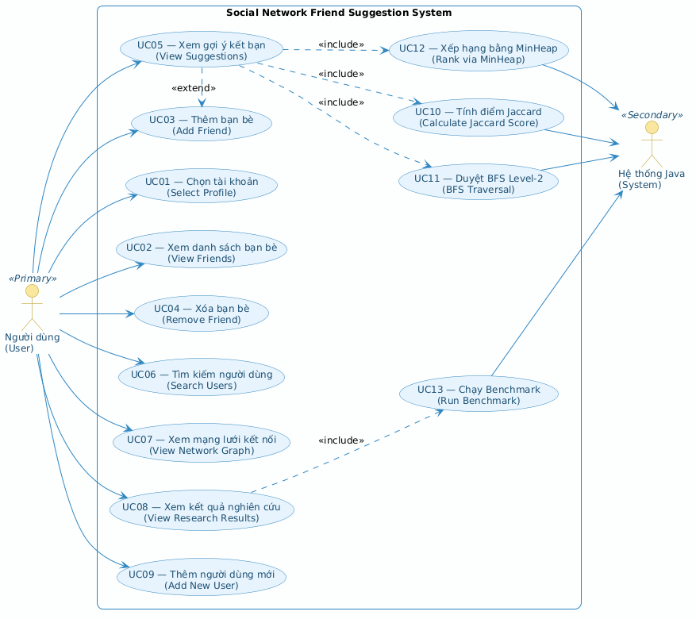
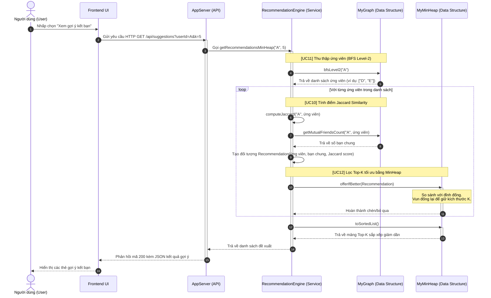
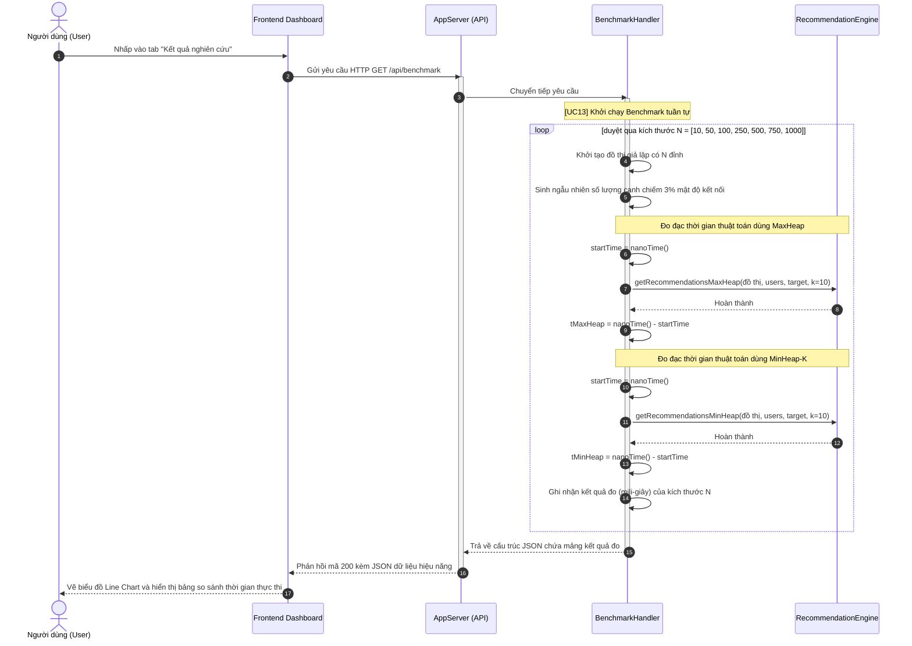

# BÁO CÁO PHÂN TÍCH USE CASE (USE CASE SPECIFICATION)
## HỆ THỐNG GỢI Ý KẾT BẠN TRÊN MẠNG XÃ HỘI (SOCIAL NETWORK FRIEND SUGGESTION SYSTEM)
**Môn học:** Cấu trúc dữ liệu và Giải thuật (CSD201)  
**Nhóm thực hiện:** Nguyễn Trí Thiện & Quang Hùng  
**Ngôn ngữ triển khai:** Java 1.8 (Thuần JDK, tự định nghĩa cấu trúc dữ liệu) & Frontend HTML/CSS/JS  

---

## 1. TỔNG QUAN HỆ THỐNG & SƠ ĐỒ USE CASE

Hệ thống hoạt động dựa trên mô hình đồ thị vô hướng biểu diễn mạng lưới xã hội, trong đó mỗi đỉnh là một người dùng (`User`) và mỗi cạnh là một mối quan hệ bạn bè (`Friendship`). Để đưa ra gợi ý kết bạn chính xác và tối ưu, hệ thống sử dụng công cụ gợi ý (Recommendation Engine) kết hợp 3 bước cốt lõi: duyệt bạn của bạn (BFS Level-2), tính chỉ số tương đồng (Jaccard Similarity) và sắp xếp lấy Top-K (MinHeap).

Dưới đây là sơ đồ Use Case của hệ thống, phân tách rõ ràng vai trò của Người dùng (Primary Actor) và Hệ thống Java (Secondary Actor):

---

## 2. DANH SÁCH ACTOR (TÁC NHÂN)

| Actor | Loại Actor | Mô tả vai trò |
| :--- | :--- | :--- |
| **Người dùng (User)** | Primary | Người dùng cuối tương tác trực tiếp với giao diện web (Frontend) để đăng nhập (chọn tài khoản), tìm kiếm, xem danh sách bạn bè, kết bạn, xóa bạn bè, xem biểu đồ mạng lưới và xem kết quả phân tích hiệu năng thuật toán. |
| **Hệ thống Java (System)** | Secondary | Hệ thống backend chịu trách nhiệm xử lý logic nghiệp vụ, thực thi các thuật toán lý thuyết đồ thị (BFS, DFS), tính toán số học (Jaccard Score), quản lý và tối ưu cấu trúc dữ liệu lưu trữ (BST, MinHeap, SinglyLinkedList), và đo đạc hiệu năng (Benchmarking). |

---

## 3. ĐẶC TẢ CHI TIẾT CÁC USE CASE DƯỚI DẠNG BẢNG

---

### UC01 — Chọn tài khoản (Select Profile)

| Thành phần | Chi tiết |
| :--- | :--- |
| **Mã & Tên Use Case** | **UC01 — Chọn tài khoản (Select Profile)** |
| **Tác nhân (Actors)** | - Primary Actor: Người dùng (User) - Secondary Actor: Hệ thống Java (System) |
| **Mô tả ngắn** | Cho phép người dùng chọn một tài khoản có sẵn trong hệ thống làm tài khoản hoạt động hiện tại (đăng nhập/giả lập) để trải nghiệm các tính năng cá nhân hóa (xem bạn bè, xem gợi ý kết bạn, v.v.). |
| **Tiền điều kiện** | Hệ thống đã khởi động thành công; cơ sở dữ liệu giả lập (`DataStore`) đã nạp đầy đủ thông tin người dùng từ file JSON vào bộ nhớ RAM. |
| **Hậu điều kiện** | Hệ thống ghi nhận tài khoản được chọn làm tài khoản hiện tại (`currentUserId`). Giao diện Frontend cập nhật thông tin hiển thị cá nhân hóa theo tài khoản này. |
| **Luồng sự kiện chính** | 1. Người dùng mở danh sách tài khoản hiện có trên giao diện. 2. Frontend gửi yêu cầu truy vấn danh sách người dùng tới backend. 3. Backend lấy tất cả người dùng từ cây tìm kiếm nhị phân chỉ mục. 4. Người dùng nhấp chọn một tài khoản từ danh sách. 5. Frontend lưu ID tài khoản đã chọn vào trạng thái cục bộ và làm mới giao diện. |
| **Luồng rẽ nhánh & Ngoại lệ** | - **Ngoại lệ (Tài khoản không tồn tại):** Nếu ID người dùng được gửi lên không tồn tại trong bộ nhớ, backend trả về lỗi 404. Hệ thống hiển thị thông báo lỗi và yêu cầu người dùng chọn lại. |
| **File Code & API xử lý** | - **API Endpoint:** `GET /api/users` (lấy danh sách) và `GET /api/users/{userId}` (lấy thông tin chi tiết) - **Class & Method:** [UserHandler.java](file:///c:/Users/TUF/OneDrive/Documents/GitHub/Social-Network-Friend-Suggestion-Project/src/api/UserHandler.java) -> phương thức `handle()` (nhánh GET) - **Cấu trúc dữ liệu:** `BinarySearchTree<String, User>` (trong `DataStore`) để tra cứu thông tin theo ID với hiệu năng trung bình là $O(\log N)$. |

---

### UC02 — Xem danh sách bạn bè (View Friends)

| Thành phần | Chi tiết |
| :--- | :--- |
| **Mã & Tên Use Case** | **UC02 — Xem danh sách bạn bè (View Friends)** |
| **Tác nhân (Actors)** | - Primary Actor: Người dùng (User) - Secondary Actor: Hệ thống Java (System) |
| **Mô tả ngắn** | Hiển thị toàn bộ danh sách bạn bè trực tiếp (bạn bè cấp 1) của tài khoản người dùng đang được chọn. |
| **Tiền điều kiện** | Người dùng đã thực hiện chọn tài khoản thành công (UC01). |
| **Hậu điều kiện** | Danh sách bạn bè trực tiếp hiển thị đầy đủ thông tin (Tên, username, bio) của từng người dùng có kết nối trực tiếp. |
| **Luồng sự kiện chính** | 1. Người dùng bấm vào thẻ "Bạn bè" hoặc tab tương ứng trên giao diện. 2. Frontend gửi yêu cầu lấy danh sách bạn bè của `userId` hiện tại tới backend. 3. Backend truy cập vào đồ thị `MyGraph` và lấy ra danh sách kề (neighbors) của đỉnh `userId`. 4. Backend dùng danh sách ID này để tra cứu thông tin chi tiết từng User trên cây chỉ mục BST. 5. Backend trả về dữ liệu định dạng JSON; Frontend hiển thị danh sách bạn bè lên màn hình. |
| **Luồng rẽ nhánh & Ngoại lệ** | - **Luồng rẽ nhánh (Chưa có bạn bè):** Nếu danh sách láng giềng trống rỗng, hệ thống trả về danh sách rỗng. Frontend hiển thị thông báo: "Bạn chưa có người bạn nào. Hãy kết bạn mới!". |
| **File Code & API xử lý** | - **API Endpoint:** `GET /api/friends?userId={userId}` (hoặc `GET /api/friends/{userId}`) - **Class & Method:** [FriendHandler.java](file:///c:/Users/TUF/OneDrive/Documents/GitHub/Social-Network-Friend-Suggestion-Project/src/api/FriendHandler.java) -> phương thức `handle()` (nhánh GET) - **Cấu trúc dữ liệu:** `MyGraph` -> `getNeighbors(userId)` trả về `MySinglyLinkedList<String>`. Sử dụng lớp `SinglyLinkedList` để duyệt tuyến tính. |

---

### UC03 — Thêm bạn bè (Add Friend)

| Thành phần | Chi tiết |
| :--- | :--- |
| **Mã & Tên Use Case** | **UC03 — Thêm bạn bè (Add Friend)** |
| **Tác nhân (Actors)** | - Primary Actor: Người dùng (User) - Secondary Actor: Hệ thống Java (System) |
| **Mô tả ngắn** | Thiết lập mối quan hệ bạn bè mới giữa tài khoản người dùng hiện tại và một người dùng khác trong hệ thống (thêm một cạnh vô hướng mới vào đồ thị). |
| **Tiền điều kiện** | Người dùng đã chọn tài khoản hoạt động (UC01); người dùng mục tiêu tồn tại trong hệ thống; hai người dùng hiện tại chưa có quan hệ bạn bè trực tiếp. |
| **Hậu điều kiện** | Một cạnh vô hướng mới nối giữa hai người dùng được ghi nhận vào đồ thị; tệp JSON lưu trữ dữ liệu được cập nhật; số lượng bạn bè của cả hai bên đều tăng lên 1. |
| **Luồng sự kiện chính** | 1. Người dùng tìm thấy tài khoản khác (qua UC06 hoặc gợi ý UC05) và bấm vào nút "Thêm bạn" (Add Friend). 2. Frontend gửi yêu cầu HTTP POST chứa ID của hai người dùng tới backend. 3. Backend thực hiện gọi phương thức thêm cạnh vô hướng trong đồ thị. 4. Backend ghi dữ liệu thay đổi xuống file `data/users.json` thông qua `DataStore`. 5. Trả về phản hồi thành công; Frontend làm mới giao diện hiển thị. |
| **Luồng rẽ nhánh & Ngoại lệ** | - **Ngoại lệ 1 (Đã là bạn bè):** Nếu đồ thị phát hiện đã tồn tại cạnh nối giữa hai người dùng, hệ thống trả về lỗi 400 "Could not create friendship. Already friends." - **Ngoại lệ 2 (ID không hợp lệ):** Nếu một trong hai ID không tồn tại trên hệ thống, trả về lỗi 400. |
| **File Code & API xử lý** | - **API Endpoint:** `POST /api/friends` với body `{"userId1": "...", "userId2": "..."}` - **Class & Method:** [GraphService.java](file:///c:/Users/TUF/OneDrive/Documents/GitHub/Social-Network-Friend-Suggestion-Project/src/service/GraphService.java) -> `addFriendship(userId1, userId2)` gọi `MyGraph.addEdge(userId1, userId2)` - **Cấu trúc dữ liệu:** `MyGraph` lưu danh sách kề của mỗi đỉnh dưới dạng một cây `MyBST<String, Boolean>`, phép chèn láng giềng mới tốn $O(\log (\text{deg}))$. |

> [!NOTE]
> **Mối quan hệ mở rộng (Extend Relationship):** UC03 mở rộng từ UC05 (Xem gợi ý kết bạn). Khi người dùng đang duyệt danh sách gợi ý bạn bè, họ có thể chọn kết bạn ngay tại giao diện gợi ý.

---

### UC04 — Xóa bạn bè (Remove Friend)

| Thành phần | Chi tiết |
| :--- | :--- |
| **Mã & Tên Use Case** | **UC04 — Xóa bạn bè (Remove Friend)** |
| **Tác nhân (Actors)** | - Primary Actor: Người dùng (User) - Secondary Actor: Hệ thống Java (System) |
| **Mô tả ngắn** | Hủy bỏ mối quan hệ bạn bè trực tiếp đang tồn tại giữa tài khoản hiện tại và một người bạn khác (xóa cạnh vô hướng khỏi đồ thị). |
| **Tiền điều kiện** | Người dùng đã chọn tài khoản hoạt động (UC01); hai tài khoản đang có quan hệ bạn bè trực tiếp với nhau (tồn tại cạnh nối trên đồ thị). |
| **Hậu điều kiện** | Cạnh vô hướng nối giữa hai đỉnh bị xóa khỏi đồ thị; tệp JSON lưu trữ dữ liệu được cập nhật; số lượng bạn bè của cả hai bên đều giảm đi 1. |
| **Luồng sự kiện chính** | 1. Người dùng vào danh sách bạn bè hoặc trang cá nhân của bạn bè và bấm vào nút "Xóa bạn" (Remove Friend). 2. Frontend gửi yêu cầu HTTP DELETE chứa ID của hai người dùng tới backend. 3. Backend thực hiện xóa cạnh liên kết giữa hai đỉnh trong đồ thị. 4. Backend ghi dữ liệu thay đổi xuống file `data/users.json` thông qua `DataStore`. 5. Trả về phản hồi thành công; Frontend làm mới giao diện hiển thị. |
| **Luồng rẽ nhánh & Ngoại lệ** | - **Ngoại lệ (Chưa kết bạn):** Nếu giữa hai đỉnh chưa có cạnh kết nối, backend trả về lỗi 400 "Not currently friends." và không thực hiện thay đổi. |
| **File Code & API xử lý** | - **API Endpoint:** `DELETE /api/friends` với body `{"userId1": "...", "userId2": "..."}` - **Class & Method:** [GraphService.java](file:///c:/Users/TUF/OneDrive/Documents/GitHub/Social-Network-Friend-Suggestion-Project/src/service/GraphService.java) -> `removeFriendship(userId1, userId2)` gọi `MyGraph.removeEdge(userId1, userId2)` - **Cấu trúc dữ liệu:** `MyGraph` thực hiện xóa nút khỏi cây láng giềng `MyBST` của đỉnh bằng giải thuật xóa nút BST với độ phức tạp $O(\log (\text{deg}))$. |

---

### UC05 — Xem gợi ý kết bạn (View Suggestions)

| Thành phần | Chi tiết |
| :--- | :--- |
| **Mã & Tên Use Case** | **UC05 — Xem gợi ý kết bạn (View Suggestions)** |
| **Tác nhân (Actors)** | - Primary Actor: Người dùng (User) - Secondary Actor: Hệ thống Java (System) |
| **Mô tả ngắn** | Gợi ý cho người dùng hiện tại danh sách Top-K người dùng khác có tiềm năng quen biết lớn nhất (được sắp xếp theo điểm tương đồng giảm dần). |
| **Tiền điều kiện** | Người dùng đã chọn tài khoản hoạt động thành công (UC01). |
| **Hậu điều kiện** | Hiển thị danh sách Top-K gợi ý kết bạn có kèm theo số bạn chung và điểm số tương đồng Jaccard Similarity cụ thể. |
| **Luồng sự kiện chính** | 1. Người dùng bấm vào mục "Gợi ý kết bạn" trên giao diện. 2. Frontend gửi yêu cầu HTTP GET tới backend kèm tham số `userId`, số lượng `k` và `heapType`. 3. **[UC11]** Backend gọi thuật toán duyệt BFS cấp 2 để lấy danh sách ứng viên (bạn của bạn). 4. **[UC10]** Backend tính toán điểm Jaccard cho mỗi ứng viên tiềm năng. 5. **[UC12]** Backend đưa các ứng viên vào cấu trúc đống nhỏ nhất `MyMinHeap` kích thước $K$ để chọn ra Top-K tốt nhất. 6. Backend trả về dữ liệu JSON; Frontend hiển thị danh sách gợi ý dưới dạng thẻ trực quan. |
| **Luồng rẽ nhánh & Ngoại lệ** | - **Luồng rẽ nhánh 1 (Người dùng chưa kết bạn với ai):** Nếu không thu được ứng viên từ BFS cấp 2, hệ thống sẽ tự động chuyển sang gợi ý những người có số lượng bạn nhiều nhất trong hệ thống. - **Luồng rẽ nhánh 2 (Cấu hình bộ lọc nâng cao):** Người dùng có thể tùy chỉnh tham số gợi ý $K$ (mặc định bằng 5) hoặc đổi thuật toán đằng sau sang MaxHeap thông qua thanh cấu hình trên giao diện. |
| **File Code & API xử lý** | - **API Endpoint:** `GET /api/suggestions?userId={userId}&k={k}&heapType={min|max}` - **Class & Method:** [SuggestionHandler.java](file:///c:/Users/TUF/OneDrive/Documents/GitHub/Social-Network-Friend-Suggestion-Project/src/api/SuggestionHandler.java) -> `handle()` gọi [RecommendationEngine.java](file:///c:/Users/TUF/OneDrive/Documents/GitHub/Social-Network-Friend-Suggestion-Project/src/service/RecommendationEngine.java) -> `getRecommendationsMinHeap()` hoặc `getRecommendationsMaxHeap()`. |

> [!IMPORTANT]
> **Mối quan hệ bao gồm (Include Relationships):** UC05 bắt buộc phải gọi đến **UC11 (Duyệt BFS Level-2)** để tìm ứng viên, **UC10 (Tính điểm Jaccard)** để chấm điểm ứng viên và **UC12 (Xếp hạng bằng MinHeap)** để trích xuất Top-K tối ưu nhất.

---

### UC06 — Tìm kiếm người dùng (Search Users)

| Thành phần | Chi tiết |
| :--- | :--- |
| **Mã & Tên Use Case** | **UC06 — Tìm kiếm người dùng (Search Users)** |
| **Tác nhân (Actors)** | - Primary Actor: Người dùng (User) - Secondary Actor: Hệ thống Java (System) |
| **Mô tả ngắn** | Cho phép người dùng tìm kiếm tài khoản khác trong hệ thống bằng cách nhập từ khóa liên quan đến Tên (Name) hoặc Tên đăng nhập (Username). |
| **Tiền điều kiện** | Không có. |
| **Hậu điều kiện** | Hiển thị danh sách các tài khoản phù hợp với từ khóa đã nhập. |
| **Luồng sự kiện chính** | 1. Người dùng nhập từ khóa tìm kiếm vào ô tìm kiếm trên thanh điều hướng. 2. Frontend thực hiện lọc danh sách người dùng đã được tải về hoặc gửi truy vấn tìm kiếm. 3. Hệ thống duyệt qua cây tìm kiếm nhị phân của tất cả người dùng để đối sánh chuỗi. 4. Giao diện hiển thị danh sách người dùng khớp kết quả kèm theo nút "Xem thông tin" hoặc "Kết bạn". |
| **Luồng rẽ nhánh & Ngoại lệ** | - **Luồng rẽ nhánh (Không tìm thấy kết quả):** Nếu không có tài khoản nào khớp từ khóa, giao diện hiển thị thông báo: "Không tìm thấy người dùng nào phù hợp với từ khóa của bạn." |
| **File Code & API xử lý** | - **API Endpoint:** Client lọc trực tiếp từ kết quả API `GET /api/users` hoặc gửi yêu cầu tra cứu. - **Class & Method:** [UserHandler.java](file:///c:/Users/TUF/OneDrive/Documents/GitHub/Social-Network-Friend-Suggestion-Project/src/api/UserHandler.java) - **Cấu trúc dữ liệu:** `BinarySearchTree<String, User>` được duyệt theo thứ tự trung vị (In-order traversal) để trích xuất danh sách người dùng đã sắp xếp tăng dần theo ID, giúp việc lọc từ khóa tuần tự rất nhanh chóng. |

---

### UC07 — Xem mạng lưới kết nối (View Network Graph)

| Thành phần | Chi tiết |
| :--- | :--- |
| **Mã & Tên Use Case** | **UC07 — Xem mạng lưới kết nối (View Network Graph)** |
| **Tác nhân (Actors)** | - Primary Actor: Người dùng (User) - Secondary Actor: Hệ thống Java (System) |
| **Mô tả ngắn** | Trực quan hóa toàn bộ mạng lưới các mối quan hệ bạn bè trong hệ thống dưới dạng đồ thị tương tác dạng nút (nodes) và liên kết (links), đồng thời hiển thị thông tin Ma trận kề (Adjacency Matrix) để nghiên cứu cấu trúc mạng. |
| **Tiền điều kiện** | Đồ thị mạng lưới có ít nhất 1 đỉnh (người dùng). |
| **Hậu điều kiện** | Giao diện hiển thị biểu đồ đồ thị Force-directed tương tác sinh động và bảng biểu diễn Ma trận kề $N \times N$. |
| **Luồng sự kiện chính** | 1. Người dùng nhấp chọn mục "Mạng lưới kết nối" hoặc "Đồ thị" trên giao diện. 2. Frontend gửi yêu cầu HTTP GET tới backend để lấy dữ liệu biểu diễn cấu trúc đồ thị. 3. Backend duyệt qua danh sách các đỉnh của đồ thị và thu thập các cạnh kết nối, dùng một BST tạm thời để loại bỏ các cạnh trùng lặp vô hướng. 4. Backend gọi cấu trúc `MyAdjacencyMatrix` để tạo ma trận kề biểu diễn đồ thị dưới dạng mảng hai chiều `boolean[][]`. 5. Backend gửi dữ liệu JSON về; Frontend dựng đồ thị tương tác và hiển thị ma trận kề lên màn hình. |
| **Luồng rẽ nhánh & Ngoại lệ** | Không có ngoại lệ. Nếu đồ thị trống, giao diện sẽ hiển thị một biểu đồ trống rỗng không có nút nào. |
| **File Code & API xử lý** | - **API Endpoint:** `GET /api/network` hoặc `GET /api/graph` - **Class & Method:** [NetworkHandler.java](file:///c:/Users/TUF/OneDrive/Documents/GitHub/Social-Network-Friend-Suggestion-Project/src/api/NetworkHandler.java) -> phương thức `handle()` gọi `Graph.getAdjacencyMatrix()` - **Cấu trúc dữ liệu:** `MyGraph` (cấu trúc danh sách kề dựa trên BST) dùng để sinh dữ liệu nút/cạnh, và `MyAdjacencyMatrix` dùng để xuất ma trận kề $N \times N$. |

---

### UC08 — Xem kết quả nghiên cứu (View Research Results)

| Thành phần | Chi tiết |
| :--- | :--- |
| **Mã & Tên Use Case** | **UC08 — Xem kết quả nghiên cứu (View Research Results)** |
| **Tác nhân (Actors)** | - Primary Actor: Người dùng (User) - Secondary Actor: Hệ thống Java (System) |
| **Mô tả ngắn** | Cho phép người dùng xem bảng so sánh lý thuyết và kết quả thực nghiệm thời gian thực thi (ms) của các thuật toán được triển khai (BFS vs DFS, Adjacency List vs Matrix, MinHeap-K vs MaxHeap). |
| **Tiền điều kiện** | Hệ thống Java backend đang chạy ổn định. |
| **Hậu điều kiện** | Hiển thị bảng biểu so sánh lý thuyết, các biểu đồ đường thể hiện thời gian chạy thực nghiệm và các phân tích khoa học liên quan đến cấu trúc dữ liệu. |
| **Luồng sự kiện chính** | 1. Người dùng mở tab "Kết quả nghiên cứu" trên giao diện Web. 2. Frontend gửi yêu cầu chạy tiến trình đo đạc tới backend. 3. **[UC13]** Backend thực thi bộ kiểm thử benchmark trên nhiều kích thước đồ thị mô phỏng khác nhau. 4. Backend trả về JSON kết quả đo thời gian chạy của thuật toán dùng MaxHeap và MinHeap. 5. Giao diện Frontend nhận kết quả, vẽ biểu đồ đường (Line Chart) so sánh hiệu năng thời gian và hiển thị bảng biểu phân tích bộ nhớ. |
| **Luồng rẽ nhánh & Ngoại lệ** | - **Ngoại lệ (Quá trình đo đạc thất bại):** Nếu tiến trình Benchmark gặp lỗi tràn bộ nhớ hoặc lỗi luồng, backend phản hồi mã lỗi 500. Frontend hiển thị thông báo: "Không thể thực hiện đo đạc hiệu năng hệ thống." |
| **File Code & API xử lý** | - **API Endpoint:** `GET /api/benchmark` - **Class & Method:** [BenchmarkHandler.java](file:///c:/Users/TUF/OneDrive/Documents/GitHub/Social-Network-Friend-Suggestion-Project/src/api/BenchmarkHandler.java) -> phương thức `handle()` kích hoạt bộ đo đạc. - **Cấu trúc dữ liệu:** Biểu đồ đường vẽ trên Frontend bằng thư viện đồ thị, kết nối trực tiếp với kết quả đo đạc từ backend. |

---

### UC09 — Thêm người dùng mới (Add New User)

| Thành phần | Chi tiết |
| :--- | :--- |
| **Mã & Tên Use Case** | **UC09 — Thêm người dùng mới (Add New User)** |
| **Tác nhân (Actors)** | - Primary Actor: Người dùng (User) - Secondary Actor: Hệ thống Java (System) |
| **Mô tả ngắn** | Cho phép đăng ký/tạo một tài khoản người dùng mới và tích hợp tài khoản này thành một đỉnh mới của đồ thị mạng xã hội. |
| **Tiền điều kiện** | Tên đăng nhập (Username) nhập vào chưa được sử dụng bởi bất kỳ tài khoản nào khác trong hệ thống. |
| **Hậu điều kiện** | Một đối tượng `User` mới được khởi tạo và ghi vào cây chỉ mục tìm kiếm; một đỉnh mới được thêm vào đồ thị; thông tin mới được cập nhật vào tệp JSON lưu trữ dữ liệu. |
| **Luồng sự kiện chính** | 1. Người dùng chọn chức năng "Thêm tài khoản" hoặc "Đăng ký". 2. Nhập đầy đủ thông tin: Họ tên (Name), Tên đăng nhập (Username), và Tiểu sử (Bio). 3. Bấm xác nhận, Frontend gửi yêu cầu HTTP POST chứa thông tin trên tới backend. 4. Backend xác thực username. Nếu hợp lệ, tự động tạo ID ngẫu nhiên, tạo đối tượng `User`, chèn đỉnh vào đồ thị, chèn nút vào cây chỉ mục BST. 5. Backend lưu trạng thái mới vào file dữ liệu JSON thông qua `DataStore` và trả về kết quả thành công. |
| **Luồng rẽ nhánh & Ngoại lệ** | - **Ngoại lệ (Trùng tên đăng nhập):** Nếu username đã tồn tại, backend trả về lỗi 400 "Username already exists. Please choose another one." Frontend hiển thị cảnh báo đỏ và yêu cầu người dùng đổi tên đăng nhập. |
| **File Code & API xử lý** | - **API Endpoint:** `POST /api/users` - **Class & Method:** [GraphService.java](file:///c:/Users/TUF/OneDrive/Documents/GitHub/Social-Network-Friend-Suggestion-Project/src/service/GraphService.java) -> `addUser(name, username, bio)` gọi `MyGraph.addVertex(userId)` - **Cấu trúc dữ liệu:** Đỉnh mới được chèn vào đồ thị `MyGraph` (tạo đỉnh mới kèm cây láng giềng `MyBST` trống rỗng); thông tin User được lưu trữ vào cấu trúc chỉ mục tìm kiếm `BinarySearchTree<String, User>`. |

---

### UC10 — Tính điểm Jaccard (Calculate Jaccard Score)

| Thành phần | Chi tiết |
| :--- | :--- |
| **Mã & Tên Use Case** | **UC10 — Tính điểm Jaccard (Calculate Jaccard Score)** |
| **Tác nhân (Actors)** | - Primary Actor: Hệ thống Java (System) - *Đây là ca sử dụng mức hệ thống* |
| **Mô tả ngắn** | Tính toán hệ số tương đồng Jaccard giữa hai người dùng dựa trên tập láng giềng bạn bè của họ, làm căn cứ chấm điểm mức độ quen biết để đưa ra gợi ý kết bạn. |
| **Tiền điều kiện** | Cả hai người dùng đều tồn tại trong đồ thị và danh sách bạn bè trực tiếp của họ không bị lỗi. |
| **Hậu điều kiện** | Trả về một số thực thuộc khoảng $[0.0, 1.0]$ đại diện cho tỷ lệ trùng lặp bạn bè của hai tài khoản. |
| **Công thức áp dụng** | $$\text{Jaccard}(A, B) = \frac{\vert A \cap B \vert}{\vert A \cup B \vert} = \frac{\text{Số bạn chung}}{\text{Tổng số bạn không trùng lặp của cả hai}}$$ |
| **Luồng sự kiện chính** | 1. Hệ thống lấy danh sách bạn bè trực tiếp của người dùng A ($L_A$) và người dùng B ($L_B$). 2. Hệ thống duyệt qua từng bạn bè trong $L_A$ và kiểm tra xem người bạn đó có xuất hiện trong $L_B$ hay không (tính tập giao $Intersection = \vert A \cap B \vert$). 3. Tính tập hợp láng giềng không trùng lặp của cả hai: $Union = \vert L_A \vert + \vert L_B \vert - Intersection$. 4. Trả về kết quả của phép toán: $Score = Intersection / Union$. |
| **Luồng rẽ nhánh & Ngoại lệ** | - **Luồng rẽ nhánh (Hợp của cả hai bằng 0):** Nếu cả hai người dùng đều chưa kết bạn với ai hoặc không có bất kỳ mối liên hệ nào, hệ thống trả về kết quả mặc định là 0.0. |
| **File Code & API xử lý** | - **Class & Method:** [RecommendationEngine.java](file:///c:/Users/TUF/OneDrive/Documents/GitHub/Social-Network-Friend-Suggestion-Project/src/service/RecommendationEngine.java) -> `computeJaccard(graph, userId1, userId2)` - **Cấu trúc dữ liệu:** Duyệt qua danh sách `SinglyLinkedList<String>` của người dùng 1, gọi phương thức `contains()` của lớp `SinglyLinkedList<String>` trên danh sách của người dùng 2 để tính toán tập giao. |

---

### UC11 — Duyệt BFS Level-2 (BFS Traversal)

| Thành phần | Chi tiết |
| :--- | :--- |
| **Mã & Tên Use Case** | **UC11 — Duyệt BFS Level-2 (BFS Traversal)** |
| **Tác nhân (Actors)** | - Primary Actor: Hệ thống Java (System) - *Đây là ca sử dụng mức hệ thống* |
| **Mô tả ngắn** | Duyệt mạng lưới đồ thị bạn bè theo chiều rộng (BFS) giới hạn ở khoảng cách kết nối bằng 2 (bạn của bạn) xuất phát từ đỉnh gốc để thu thập các ứng viên kết bạn tiềm năng nhất. |
| **Tiền điều kiện** | Đỉnh gốc tồn tại trong đồ thị và có ít nhất 1 mối liên kết bạn bè trực tiếp. |
| **Hậu điều kiện** | Trả về mảng danh sách ID người dùng thỏa mãn điều kiện: là bạn của bạn trực tiếp, không phải là chính mình và không phải là người đã kết bạn trực tiếp với đỉnh gốc. |
| **Luồng sự kiện chính** | 1. Khởi tạo hàng đợi `MyQueue` và đẩy toàn bộ láng giềng trực tiếp của đỉnh gốc vào hàng đợi. 2. Khởi tạo cây loại trừ `excluded` (`MyBST`) chứa ID của đỉnh gốc và các bạn trực tiếp. 3. Khởi tạo cây đã thăm `visitedFOF` (`MyBST`) và danh sách kết quả động `resultList`. 4. Lần lượt lấy một người bạn ra khỏi hàng đợi (`dequeue`). 5. Lấy danh sách láng giềng của người bạn này. Với mỗi láng giềng: &nbsp;&nbsp;&nbsp;&nbsp;- Nếu không nằm trong cây loại trừ `excluded` và chưa nằm trong cây `visitedFOF`: &nbsp;&nbsp;&nbsp;&nbsp;&nbsp;&nbsp;&nbsp;&nbsp;+ Thêm láng giềng vào cây `visitedFOF`. &nbsp;&nbsp;&nbsp;&nbsp;&nbsp;&nbsp;&nbsp;&nbsp;+ Thêm láng giềng vào đuôi danh sách kết quả `resultList`. 6. Chuyển đổi `resultList` thành mảng chuỗi `String[]` và trả về kết quả. |
| **Luồng rẽ nhánh & Ngoại lệ** | - **Luồng rẽ nhánh (Không có bạn bè trực tiếp):** Nếu đỉnh gốc chưa kết bạn với ai, trả về mảng rỗng ngay lập tức. |
| **File Code & API xử lý** | - **Class & Method:** [MyGraph.java](file:///c:/Users/TUF/OneDrive/Documents/GitHub/Social-Network-Friend-Suggestion-Project/src/datastructures/MyGraph.java) -> `bfsLevel2(startUserId)` - **Cấu trúc dữ liệu:** Hàng đợi tự định nghĩa `MyQueue<String>`, cây nhị phân tìm kiếm tự định nghĩa `MyBST<String, Boolean>` làm Set lưu trữ trạng thái loại trừ/đã thăm, và danh sách liên kết đơn tự định nghĩa `MySinglyLinkedList<String>` làm danh sách chứa kết quả động. |

---

### UC12 — Xếp hạng bằng MinHeap (Rank via MinHeap)

| Thành phần | Chi tiết |
| :--- | :--- |
| **Mã & Tên Use Case** | **UC12 — Xếp hạng bằng MinHeap (Rank via MinHeap)** |
| **Tác nhân (Actors)** | - Primary Actor: Hệ thống Java (System) - *Đây là ca sử dụng mức hệ thống* |
| **Mô tả ngắn** | Sử dụng cấu trúc dữ liệu đống nhỏ nhất (MinHeap) kích thước cố định bằng $K$ để lọc và xếp hạng Top-K ứng viên có điểm Jaccard cao nhất từ danh sách ứng viên một cách tối ưu. |
| **Tiền điều kiện** | Danh sách ứng viên thu được từ BFS cấp 2 có kích thước lớn hơn 0; tham số gợi ý $K > 0$. |
| **Hậu điều kiện** | Trả về một danh sách liên kết đơn chứa tối đa $K$ đối tượng `Recommendation` được sắp xếp theo độ tương đồng giảm dần. |
| **Luồng sự kiện chính** | 1. Khởi tạo đối tượng `MyMinHeap<Recommendation>` có dung lượng cố định là $K$. 2. Duyệt qua từng ứng viên trong danh sách: &nbsp;&nbsp;&nbsp;&nbsp;- Tính điểm Jaccard Similarity (UC10) và số lượng bạn chung. &nbsp;&nbsp;&nbsp;&nbsp;- Đóng gói thông tin thành đối tượng `Recommendation`. &nbsp;&nbsp;&nbsp;&nbsp;- Gọi hàm chèn đống tối ưu `offerIfBetter(recommendation)`. 3. Đống MinHeap tự động so sánh điểm số của đối tượng mới với đỉnh đống (phần tử nhỏ nhất hiện tại). Nếu tốt hơn, loại bỏ đỉnh đống (`extractMin`) và chèn phần tử mới vào; ngược lại thì bỏ qua. 4. Sau khi duyệt xong ứng viên, lấy tất cả các gợi ý còn lại trong Heap ra và đảo ngược thứ tự để thu được danh sách đã được sắp xếp giảm dần theo điểm tương đồng. |
| **Luồng rẽ nhánh & Ngoại lệ** | Không có ngoại lệ. Nếu số lượng ứng viên nhỏ hơn $K$, đống MinHeap sẽ chứa toàn bộ ứng viên hiện có mà không loại bỏ phần tử nào. |
| **File Code & API xử lý** | - **Class & Method:** [MyMinHeap.java](file:///c:/Users/TUF/OneDrive/Documents/GitHub/Social-Network-Friend-Suggestion-Project/src/datastructures/MyMinHeap.java) -> các phương thức `insert()`, `extractMin()`, `offerIfBetter()`, `toSortedList()`. Đối tượng so sánh là [Recommendation.java](file:///c:/Users/TUF/OneDrive/Documents/GitHub/Social-Network-Friend-Suggestion-Project/src/model/Recommendation.java) cài đặt interface `Comparable`. |

---

### UC13 — Chạy Benchmark (Run Benchmark)

| Thành phần | Chi tiết |
| :--- | :--- |
| **Mã & Tên Use Case** | **UC13 — Chạy Benchmark (Run Benchmark)** |
| **Tác nhân (Actors)** | - Primary Actor: Hệ thống Java (System) - *Đây là ca sử dụng mức hệ thống* |
| **Mô tả ngắn** | Kích hoạt bộ sinh dữ liệu mô phỏng và đo đạc thời gian thực thi (mili-giây) của thuật toán sắp xếp gợi ý kết bạn bằng MinHeap kích thước $K$ so với MaxHeap trên nhiều quy mô mạng lưới khác nhau để lập báo cáo hiệu năng. |
| **Tiền điều kiện** | Backend nhận được tín hiệu yêu cầu chạy thử nghiệm hiệu năng từ API REST. |
| **Hậu điều kiện** | Trả về một chuỗi JSON chứa danh sách mảng số liệu thời gian chạy (ms) tương ứng với từng kích thước đồ thị mô phỏng. |
| **Luồng sự kiện chính** | 1. Backend khởi động tiến trình lặp qua các kích thước đồ thị thử nghiệm: $N \in \{10, 50, 100, 250, 500, 750, 1000\}$. 2. Với mỗi kích thước $N$, backend khởi tạo một đồ thị rỗng, chèn $N$ đỉnh và sinh ngẫu nhiên số lượng cạnh chiếm đúng 3% mật độ đồ thị tối đa. 3. Chọn đỉnh `temp_0` làm đỉnh gốc mục tiêu, đặt tham số gợi ý $K = 10$. 4. Backend ghi nhận thời gian bắt đầu và kết thúc khi chạy gợi ý bằng thuật toán dùng đống MaxHeap (`System.nanoTime()`). 5. Backend ghi nhận thời gian bắt đầu và kết thúc khi chạy gợi ý bằng thuật toán dùng đống MinHeap (`System.nanoTime()`). 6. Đóng gói kết quả đo đạc thành JSON và gửi phản hồi. |
| **Luồng rẽ nhánh & Ngoại lệ** | - **Ngoại lệ (Lỗi sinh đồ thị):** Nếu việc sinh đồ thị ngẫu nhiên gặp lỗi logic, hệ thống ghi nhận ngoại lệ, dừng tiến trình đo và trả về mã lỗi HTTP 500 cùng nội dung lỗi. |
| **File Code & API xử lý** | - **API Endpoint:** `GET /api/benchmark` - **Class & Method:** [BenchmarkHandler.java](file:///c:/Users/TUF/OneDrive/Documents/GitHub/Social-Network-Friend-Suggestion-Project/src/api/BenchmarkHandler.java) -> phương thức `handle()` gọi các phương thức tương ứng của lớp [RecommendationEngine.java](file:///c:/Users/TUF/OneDrive/Documents/GitHub/Social-Network-Friend-Suggestion-Project/src/service/RecommendationEngine.java). |

---

## 4. BIỂU ĐỒ TRÌNH TỰ (SEQUENCE DIAGRAM) CỦA CÁC LUỒNG TIÊU BIỂU

### 4.1 Luồng Gợi Ý Bạn Bè (UC05 bao gồm UC10, UC11, UC12)

Dưới đây là biểu đồ mô tả cách thức tương tác giữa các thành phần khi người dùng yêu cầu xem danh sách gợi ý kết bạn. Tiến trình này tích hợp toàn bộ các ca sử dụng hệ thống phụ để tối ưu hóa việc tìm kiếm và lọc kết quả:

---

### 4.2 Luồng Đánh Giá Hiệu Năng Benchmarking (UC08 bao gồm UC13)

Biểu đồ này mô tả cách thức hệ thống tự động sinh dữ liệu thực nghiệm và đo đạc thời gian thực thi thuật toán để so sánh hai cấu trúc Heap phục vụ báo cáo khoa học:

---

## 5. TỔNG KẾT VỀ MỐI TƯƠNG QUAN GIỮA CẤU TRÚC DỮ LIỆU TỰ ĐỊNH NGHĨA VÀ HIỆU NĂNG USE CASE

Việc tự cài đặt các cấu trúc dữ liệu thuần JDK 1.8 trong đồ án môn CSD201 này đóng vai trò quyết định trong việc tối ưu hóa hiệu năng của các Use Case chính trên hệ thống:

1. **Ma trận kề (`MyAdjacencyMatrix`) vs Danh sách kề kết hợp cây BST (`MyGraph`)**:
   * Đối với mạng xã hội thưa (mật độ cạnh chỉ ~3%), việc sử dụng cấu trúc `MyGraph` (Adjacency List) giúp tiết kiệm bộ nhớ gấp nhiều lần so với `MyAdjacencyMatrix` ($O(V + E)$ so với $O(V^2)$).
   * Đặc biệt, trong `MyGraph`, láng giềng của mỗi đỉnh được lưu trữ dưới dạng một cây tìm kiếm nhị phân `MyBST` thay vì một LinkedList tuần tự. Điều này giúp đẩy tốc độ kiểm tra mối quan hệ bạn bè trực tiếp giữa hai đỉnh (phục vụ cho **UC03**, **UC04**, **UC10**) từ mức duyệt tuyến tính $O(\text{deg})$ xuống mức tìm kiếm nhị phân $O(\log (\text{deg}))$.
2. **MinHeap kích thước $K$ (`MyMinHeap`) vs MaxHeap kích thước $N$ (`MyMaxHeap`)**:
   * Khi thực hiện ca gợi ý bạn bè (**UC05**), nếu sử dụng MaxHeap thông thường, hệ thống sẽ chèn toàn bộ $N$ người dùng (ứng viên) vào Heap rồi lấy ra $K$ lần, dẫn đến độ phức tạp thời gian là $O(N \log N)$.
   * Bằng cách thiết kế thuật toán `offerIfBetter` tích hợp trong `MyMinHeap` kích thước cố định bằng $K$, độ phức tạp giảm xuống chỉ còn $O(N \log K)$. Vì số lượng gợi ý cần lấy luôn rất nhỏ so với tổng số người dùng ($K \ll N$, thường $K=5$ hoặc $K=10$), thuật toán sử dụng MinHeap-K chạy nhanh hơn vượt trội ở các quy mô dữ liệu lớn ($N \ge 750$), giúp hệ thống backend chạy mượt mà mà không lo nghẽn hay tràn bộ nhớ đệm JVM.
